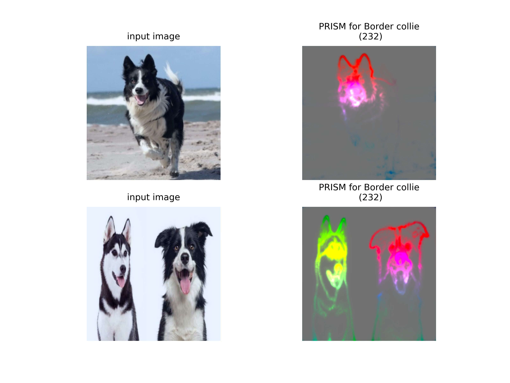
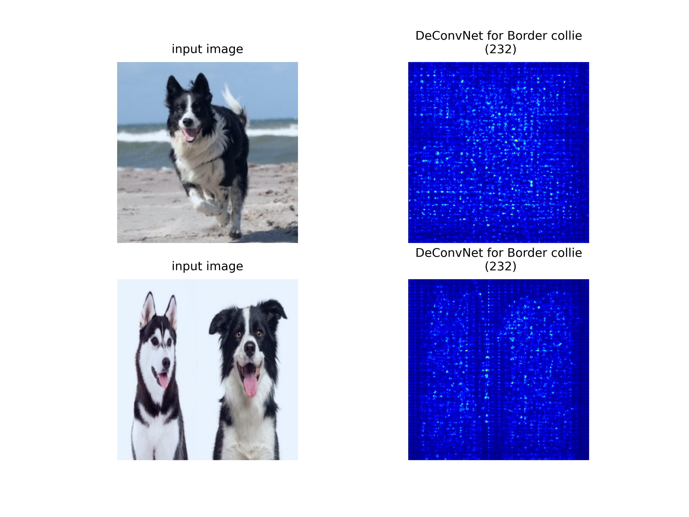
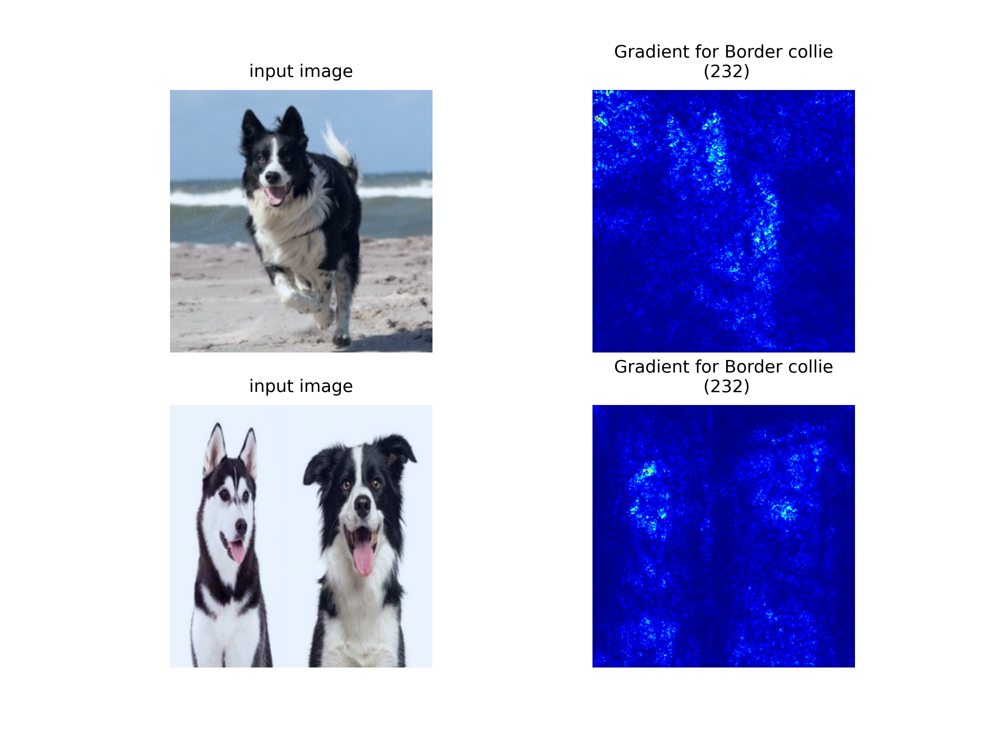
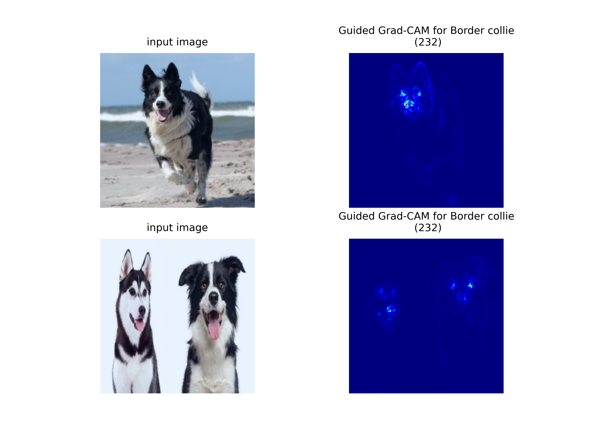
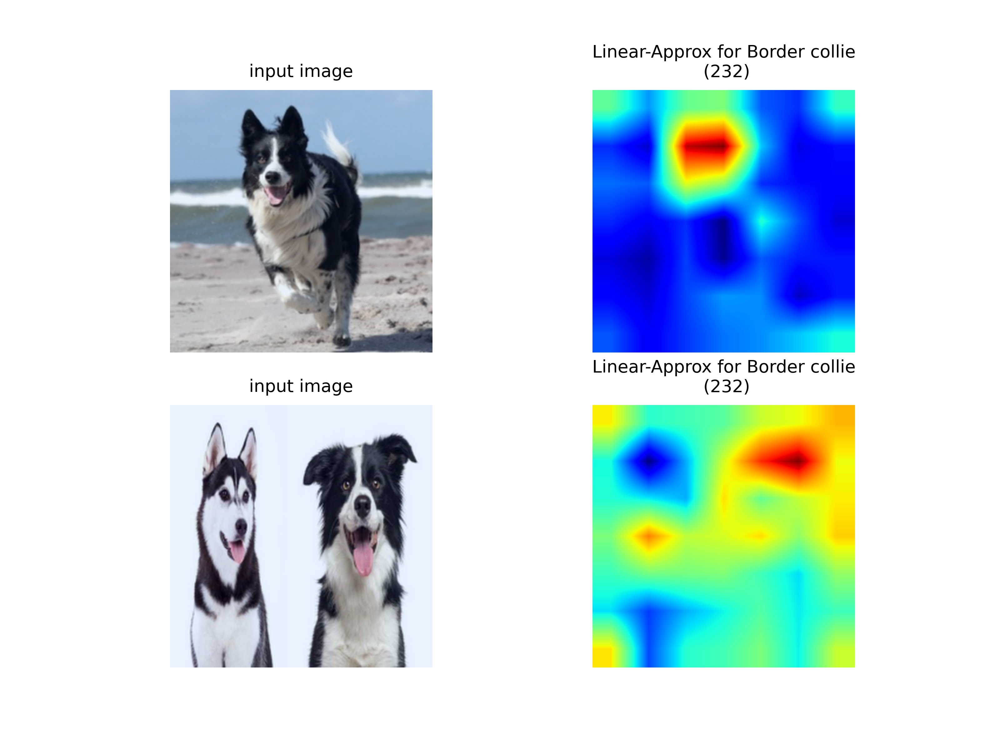

# PRISM vs other methods

## Table of Contents
* [Research Sample](#Research_Sample)
* [Targeted vs UnTargeted](#Targeted_vs_UnTargeted)
* [UnTargeted Methods](#UnTargeted_Methods)
  * [PRISM](#PRISM)
  * [DeConvNet](#DeConvNet)
  * [Guided Backpropagation](#Guided_Backpropagation)
* [Targeted Methods](#Targeted_Methods)
  * [Grad-CAM](#Grad-CAM)
  * [Guided Grad-CAM](#Guided_Grad-CAM)
  * [Excitation Backpropagation](#Excitation_Backpropagation)
  * [Linear approximation](#Linear_approximation)

## Research Sample
For the comparison we have chosen 2 images. One representing Border Collie dog and second with Border Collie and Siberian Husky specimens.

## Targeted vs UnTargeted
Distinction between Targeted and UnTargeted methods means that some of them aim to highlight features with repect to chosen class. UnTargeted methods try to explain what model has seen in the image and does not specify how important it has been to the certain classes. In other words they are agnostic to the classification.

## UnTargeted Methods

### PRISM

The first comes of course the Principal Image Sections Mapping (PRISM). It relies on extracting the important features that contributed to the model output. While output for a single image does not provide worldbreaking changes, if we expand process to several images we the PRISM starts to shine. It clearly highlights with different color recognized features in all considered images thus gives us insight, through set difference, into which features are discriminative for classes.



### DeConvNet

First, we will compare results to the DeconvNet proposed by Zeiler et al. This was actually one of the first of techniques prposed for explaining DNNs. The central idea of Zeiler et al. is to visualize layer activations of a ConvNet by running them through a "DeconvNet" - a network that undoes the convolutions and pooling operations of the ConvNet until it reaches the input space. Deconvolution is defined as convolving an image with the same filters transposed, and unpooling is defined as copying inputs to the spots in the (larger) output that were maximal in the ConvNet (i.e., an unpooling layer uses the switches from its corresponding pooling layer for the reconstruction). Any linear rectifier in the ConvNet is simply copied over to the DeconvNet.

DeconvNet exactly corresponds to simply backpropagating through the ConvNet, except for the linear rectifier. So again, this can be implemented by modifying the gradient of the rectifier: Instead of propagating the error back to every positive input, propagate back all positive error signals. Note that this is equivalent to applying the linear rectifier to the error signal.



```raw
Zeiler, Matthew D., and Rob Fergus. "Visualizing and understanding convolutional networks." European conference on computer vision. Springer, Cham, 2014.
```

### Guided Backpropagation

Springenberg et al. proposes to change a tiny detail for backpropagating through the linear rectifier, the nonlinearity used in all the layers of the network except for the final output layer.

The guided-backpropagation method determines the parts of a particular input image that resulted in a strongly winning class activation. The guided backpropagation process, which is a mixture of backpropagation based on the input data and a deconvolution of the gradient, hides the influence of negative gradients which decrease the activation of the target neuron while highlighting regions that strongly affect the target neuron.

This results in a map displayplying pixels that contributed the most to the overall model output. Nonetheless, in Guided Backpropagation visualizations classes are still indistinguishable.


```raw
Springenberg, J., et al. "Striving for Simplicity: The All Convolutional Net." ICLR (workshop track). 2015.
```

## Targeted Methods

### Gradient

Integrated Gradient is an interpretability or explainability technique for deep neural networks which visualizes its input feature importance that contributes to the model's prediction.
Integrated Gradient is built on two axioms which need to be satisfied:
* Sensitivity and
* Implementation

To calculate the Sensitivity, we establish a Baseline image as a starting point. We then build a sequence of images which we interpolate from a baseline image to the actual image to calculate the integrated gradients.

Implementation invariance is satisfied when two functionally equivalent networks have identical attributions for the same input image and the baseline image.
Two networks are functionally equivalent when their outputs are equal for all inputs despite having very different implementations.

It does not need any modification to the original deep neural network and can be applied to images, text as well as structured data.



```raw
Simonyan, Karen, Andrea Vedaldi, and Andrew Zisserman. "Deep inside convolutional networks: Visualising image classification models and saliency maps." (2014).
Srinivas, Suraj, and Francois Fleuret. Full-Gradient Representation for Neural Network Visualization. No. CONF. 2019.
```

### Grad-CAM


```
Selvaraju, Ramprasaath R., et al. "Grad-cam: Visual explanations from deep networks via gradient-based localization." Proceedings of the IEEE international conference on computer vision. 2017.
```

### Guided Grad-CAM

Grad-CAM may be combined with existing pixel-space visualizations, most notably with Guided Backpropagation, to create a high-resolution class-discriminative visualization. In order to obtain it we just multiply result from Grad-CAM and Guided Propagation.



```raw
Selvaraju, Ramprasaath R., et al. "Grad-cam: Why did you say that?." arXiv preprint arXiv:1611.07450 (2016).
```
### Excitation Backpropagation

Between activation neurons, we define a connection to be excitatory if its weight is non-negative, and inhibitory otherwise. Excitation Backprop passes top-down signals through excitatory connections between activation neurons.
Recursively propagating the top-down signal layer by layer we can compute attention maps from any intermediate convolutional layer. For this method, we simply take the sum across channels to generate a marginal winning probability map as our attention map, which is a 2D probability heatmap.

Neurons at higher-level layers have larger receptive fields and strides. Thus, they can capture larger areas but with lower spatial accuracy. Neurons at lower layers tend to more precisely localize features at smaller scales. Therefore we should always aim, with this method, for a balance between readability nad usability.


```raw
Zhang, Jianming, et al. "Top-down neural attention by excitation backprop." International Journal of Computer Vision 126.10 (2018): 1084-1102.
```

### Linear Approximation


